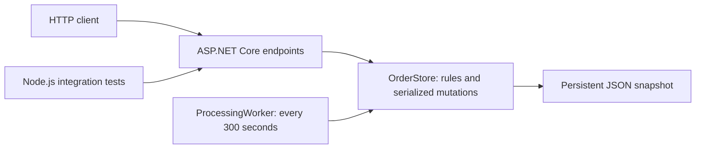

# Architecture and interview walkthrough

## End-to-end flow

1. ASP.NET Core parses requests into typed records.
2. The store validates inputs and business rules.
3. A mutation takes the shared lock, builds a new snapshot, flushes a temporary file and replaces the data file.
4. The store publishes the new in-memory state only after persistence succeeds.
5. The endpoint returns the representation and appropriate HTTP status.
6. The background worker performs a batch transition using the same store and lock.

## Code walkthrough and patterns

Read Program.cs, Models.cs, OrderStore.cs, ProcessingWorker.cs, then tests/api.test.mjs.

- Dependency injection: the host owns a singleton store shared by endpoints and the worker. One store instance is essential for coordination in this design.
- Encapsulation: callers cannot assign IDs, totals, timestamps or initial status. The store owns these invariants.
- Finite-state model: PENDING -> PROCESSING -> SHIPPED -> DELIVERED, or PENDING -> CANCELLED. A switch over state pairs implements this. It is not the class-per-state GoF State pattern; the small rule set does not need that complexity.
- Persistence boundary: the store exposes repository-like operations and contains business rules. It is deliberately compact, not full clean architecture. Split a domain service from a persistence interface when complexity or another adapter justifies it.
- Hosted service: BackgroundService and PeriodicTimer manage lifecycle, cancellation and non-overlapping ticks. Storage failures are logged and retried at the next tick.
- Concurrency: cancellation and processing share a critical section; only one transition from PENDING can win. Repeating the current status is a no-op.
- Money: C# decimal and precision validation avoid binary floating-point total errors.
- Persistence: a file ownership lock rejects a second process using the same file. Corrupt JSON fails startup instead of discarding orders.

## Questions to prepare for

**Why one service?** The workflow is small. One service keeps the cancellation race in one transaction boundary. Messaging or microservices would need a concrete requirement, such as independent fulfillment integration.

**Why no runtime AI feature?** Deterministic order transitions do not need model calls. AI assistance is disclosed as part of engineering. A support assistant or semantic product search would be a separate feature requiring evaluation.

**Why file storage?** Setup stays dependency-free while demonstrating persistence. It is single-process, holds all orders in memory and rewrites the dataset on mutations. For multiple instances, use a transactional database and conditional status updates; an in-process lock cannot coordinate replicas.

**What happens when storage fails?** The new snapshot is not published in memory; the request fails. The worker logs the failure and retries on the next tick. Disk faults have not been injected in tests, and power-loss behavior depends on the filesystem.

**How does scheduling work?** The first tick is one interval after startup. Each tick processes all currently pending orders, rather than waiting until each is five minutes old. Downtime is not replayed.

**What would production need?** Authentication, ownership checks, catalog pricing, inventory/payments, checkout idempotency, database migrations, monitoring, readiness checks and load testing. These are not claimed as implemented.

## Live demonstration

1. Run scripts/Run.ps1 and inspect /health.
2. Run scripts/Demo.ps1 in another terminal. It creates and retrieves a multi-item order, delivers it, proves cancellation returns 409, cancels another pending order, and leaves a third for the worker.
3. After a tick, retrieve the third order to show PROCESSING. For a faster worker demonstration restart with -ProcessingIntervalSeconds 10, explaining that the default remains 300.
4. Restart and retrieve an earlier order to show persistence.
5. Run scripts/Test.ps1 for automated checks.
6. Explain the AI usage log and a design tradeoff you understand.

Demo.ps1 creates sample orders in the target server. Use the default interval for its deterministic flow; with a very short interval, the worker can correctly win the race against its cancellation request.
